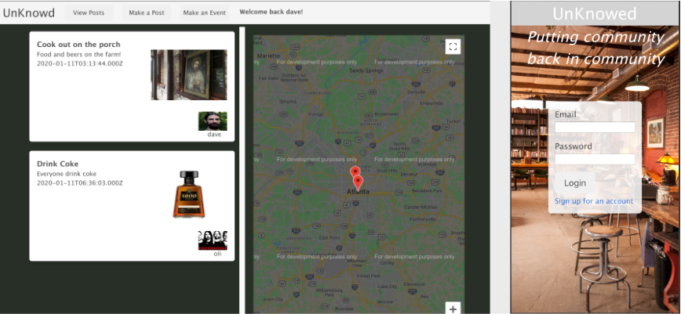

# The unKnowd

A community platform to help bring the community back into community. Some communities need a platform for communicating in a public / private way that doesn't promote the stalking and frieding practices of Facebook and other social networks.

- Realtime updating of events to the public via available public displays [https://unknowd.herokuapp.com/viewer](https://unknowd.herokuapp.com/viewer)
- Users can communicate with the community without having to first friend everyone and or passaround information - you need to borrow a ladder? Ask the real life people in you local community 
- Users can upload photos so it's easier to recognize people you don't see as often in the community and applies that photo to posts and events
- Community members can post events like simple a gather for food or a gallery opening across town

## Technology

- Socketio Websockets for real time updates
- ReactJS for a fast reasponsive application minimizing page reload times
- Google Maps for show where in the area posted events may be happening
- Bcrypt and JSON Web Tokens for authentication
- Expres-fileupload with Cloudinary hosting for persistant photo uploads
- MongoDB with Mongoose ODM for storing user information, photo urls, and content
- Bulma CSS
- React-datepicker for a realible datepicking method for consistent database entry

### Challenges

Workign around React really slowed us down on this project along with working through websockets implementation initially. Some of the Bulma styling didn't work with React as expected and resulted in a little more work in layout and design. Future release should include the ability to reply to posts and events as the database is designed to handle it already.

