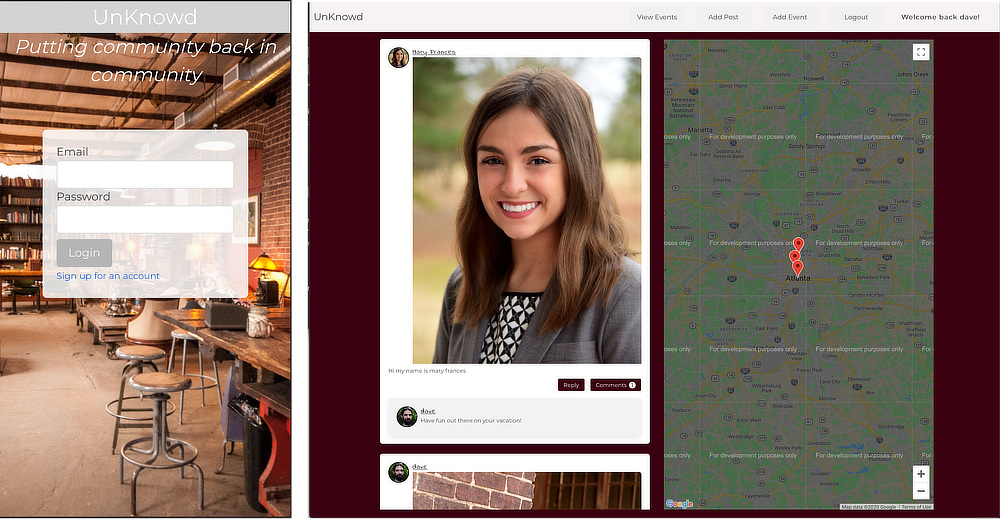
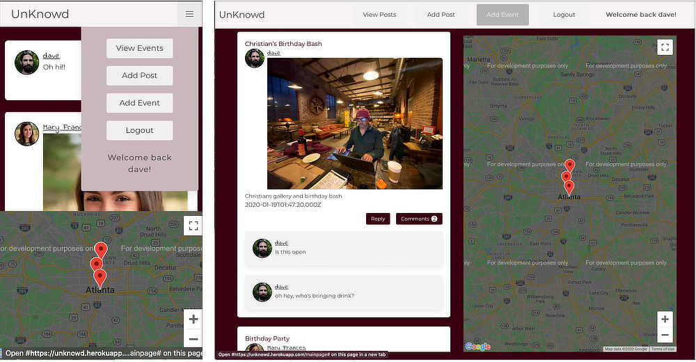
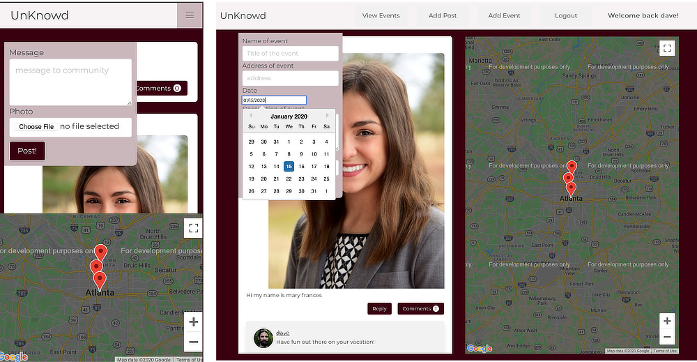

# The unKnowd

A community platform to help bring the community back into community. Some communities need a platform for communicating in a public / private way that doesn’t promote the stalking and friending practices of Facebook and other social networks. Real community for real people.

- Realtime updating of events to the public via available public displays [https://unknowd.herokuapp.com/viewer](https://unknowd.herokuapp.com/viewer)
- Users can communicate with the community without having to first friend everyone and or pass around information - need to borrow a ladder? Ask the real life people in you local community
- Users can upload photos so it’s easier to recognize people you don’t see as often in the community and applies that photo to posts and events
- Community members can post events like a simple gathering for food or a gallery opening across town

## Technology

- Socketio websockets real time updating to our view display and connected users
- ReactJS providing a fast responsive application minimizing page reload times
- Google Maps showing where in the area posted events may be happening
- Bcrypt and JSON Web Tokens providing authentication
- Express-fileupload with Cloudinary hosting granting persistent photo uploads
- MongoDB with Mongoose ODM storing user information, photo urls, and content
- Bulma CSS framework and sass variables allowing simple flexible styling
- React-datepicker reliable cross-brosser date picking method for consistent database entry

### Challenges

Working around React really slowed us down on this project along with working through websockets implementation initially. Some of the Bulma styling didn’t work with React as expected and resulted in a little more work in layout and design. Specifically breaking out components in later updates and breaking apart the main Bulma Sass to import just what we needed. Future release should include the ability to reply to posts and events as the database is designed to handle it already.

### Updates

As a work in progress here’s what what’s been added:

- lots of styling work for better readability
- replies to posts and comments - no photo uploads yet
- add close button to reply without submitting reply
- broke out some components in an effort to start code cleanup

