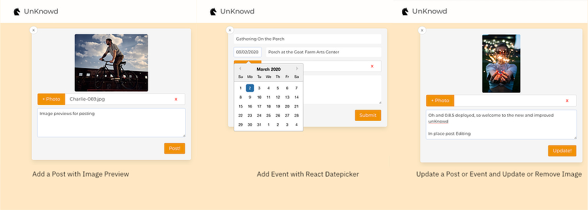

# The unKnowd

A community platform to help bring the community back into community.

This project set out to solve a real world problem of a local art community: people felt left out because they didn’t know what was going on with events and gatherings. As a result, one of the requirements became having viewer displays available for visitors and those that don’t log into anything. Primary key components used to build the platform are React.js, WebSockets, and MongoDB. All posts and updates are broadcast and updated in realtime to displays and users.

Real community for real people without the social stalking.

## Highlights

- Realtime updating of events to the public via available public displays [https://unknowd.herokuapp.com/viewer](https://unknowd.herokuapp.com/viewer)
- Current design goals only make public events available to viewer displays
- Users can communicate with the community without having to first friend everyone - need to borrow a ladder or need a hand? Ask the real people in your community
- Users can upload photos so it’s easier to recognize people you don’t see often in the community and applies that photo to posts and events
- Community members can post events like a simple gathering for food or a gallery opening across town

      

## Technology

- Socketio websockets real time updating to our view display and connected users
- ReactJS providing a fast responsive application minimizing page reload times
- Google Maps showing where in the area posted events may be happening
- Bcrypt and JSON Web Tokens providing authentication
- Express-fileupload with Cloudinary hosting granting persistent photo uploads
- MongoDB with Mongoose ODM storing user information, photo urls, and content
- Bulma CSS framework and sass variables allowing simple flexible styling
- React-datepicker reliable cross-brosser date picking method for consistent database entry
- Nodemailer for sending out our tokens for password resets

# Deployment

## Heroku

1. Fork the repo
2. Login to Heroku and make a new app.
3. Go to Deploy menu within the app and connect to Github
4. Go to Resources and add Cloudinary
5. If you want to use mLab database you can add it as well - I’m using MongoDB Atlas
6. Go to settings and click Reveal Config Vars
   You’ll need to have:
   1. CLOUDINARY_URL (this should be filled in when adding to app)
   2. MAP_API (This is a Google map api key you’ll need to get from Google)
   3. GOOGLE_GEOCODE is another Google api key (I separated mine)
   4. MONGODB_URI (this should be filled in for you if you used mLab)
   5. SECRET (this is just a string used for tokens)
   6. PM2 Keys can be found on [https://app.pm2.io/](https://app.pm2.io/) via the blue Connect button at top
   For sending password reset mails you'll need:
   1. MAIL_SERVER_NAME is just an identifier
   2. RETURN_ADDRESS
   3. SMTP_LOGIN
   4. SMTP_PASSWORD
   5. SMTP_PORT
   6. SMTP_SECURE true if port 465 otherwise false
   7. SMTP_SERVER
7. Once all that’s done you can go back to deploy towards the bottom and deploy your master branch

## Local
   You can run development build with `npm start` or you can run develoment build by first running `npm run build` to build it followed by `ENV_NODE=production npm start`

# Updates

**Issues for Enahncements / features can be tracked:** [Enhancement Issues](https://github.com/echo-dave/unKnowd/issues?utf8=✓&q=is%3Aissue+is%3Aopen+label%3Aenhancement)

As a work in progress here’s what what’s been added:

- lots of styling work for better readability
- replies to posts and comments
- photo uploads for comments
- add close button to reply without submitting reply
- broke out some components in an effort to start code cleanup
- added a user profile page for updating info - click name / photo top right
- added signup form validations that were missing
- realtime comment updating is now working
- proper passwrod reset function emailing token

